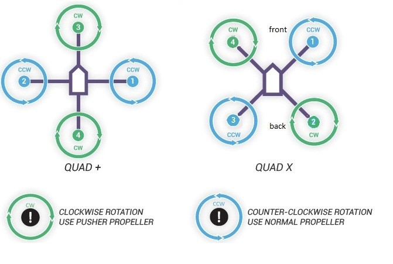
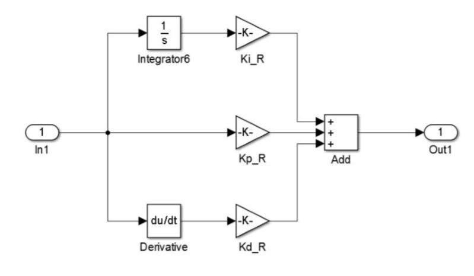

# **Gesture Controlled Quadcopter**

**(Arduino as Flight Controller)**

**Abstract:**

This Project shows the controlling of quadcopter using gestures. We designed our own control strategy and implemented in Arduino UNO. The sensors like accelerometer, gyroscope attached to the quad copter sense the movement and orientation of quad copter. For controlling the motion of the quadcopter on three directions using gestures in which mobile phone acts as a gesture tool.

**Mechanical Design:**

**Hardware Components Used:**

- Arduino UNO
- ESP8266
- MPU-6050
- Burshless Motors 1000KV-4
- Electronic Speed Controllers-4
- 4-legged Frame
- Lipo Battery 5200mAh

Generally flying a quadcopter is divided into two configurations.

Such as X-Configuration and P-Configuration.

**The motor rotations of quad is as shown**


<!--  -->

We choose X-Configuration to fly our quadcopter.

**Controlling motion of X-Configured Quad:**

- If the quad needs to take off without any drift i.e., only in z-direction then only the throttle must be given rest all other to be in normal position.
- If the quad needs to move forward, then speed of motors 1 and 4 should be reduced accordingly and speed of motors 2 and 3 should be increased. This motion is known as **pitch**.
- If the quad needs to move right-side then the speed of motors 1 and 2 should be reduced and speed of motors 2 and 4 must be increased. Similarly, to move left side the speed of motors 1 and 2 must be increased and the speed of motors 3 and 4 must be decreased. This motion of the quad is known as roll or aileron.
- If the quad needs to be self-rotated in clockwise then speed of motors 1 and 3 are to reduce and speed to motors 2 and 4 must be increased. If the quad needs to be self-rotated in counterclockwise direction then the speed of the motors 2 and 4 must be decreased and speed to motors 1 and 3 must be increased. This motion of the quad is knowing as yaw.

This entire thing is given in equation form as follows:

esc\_1 = throttle - pid\_output\_pitch + pid\_output\_roll - pid\_output\_yaw; //Calculate the pulse for esc 1 (front-right - CCW)

esc\_2 = throttle + pid\_output\_pitch + pid\_output\_roll + pid\_output\_yaw; //Calculate the pulse for esc 2 (rear-right - CW)

esc\_3 = throttle + pid\_output\_pitch - pid\_output\_roll - pid\_output\_yaw; //Calculate the pulse for esc 3 (rear-left - CCW)

esc\_4 = throttle - pid\_output\_pitch - pid\_output\_roll + pid\_output\_yaw; //Calculate the pulse for esc 4 (front-left - CW)

These are the values given to respective Electronic Speed Controllers which gives the speed for motors.

Our Controller uses closed loop controllers to ensure its stability and manoeuvrability. We use Proportional-Integral-Derivative (PID) controllers.

When the quad copter orientation is changed in any pitch/roll/yaw axis, the gyros indicate an angular change from its initial position. The quad copter controller tries to correct the error calculated between a measurement at the controller output (measured by the gyros) and an input set point (position of the stick), and drives the motors to attempt to return the quad copter to its initial position.

**PID Controller:**


<!--  -->

Generalized PID equation is

_**u(t) = Kp\*e(t) + Ki\* ∫e(τ)dτ + Kd\* d/dt(e(t));**_

_**where Kp,Ki,andKd, all non-negative, denote the coefficients for the proportional, integral, and derivative terms, respectively (sometimes denoted P, I, and D)**_

_ **Basic PID Tuning:** _

Default values should be used as a starting point, this will help us to know the difference after changing some parameters. Those value are well suited for the average quad copter.

1. Ensure [CofG](http://www.multiwii.com/wiki/index.php?title=Jargon#CofG) is in the middle of our copter, move battery to get it there.
2. Set motors running at approx. 50% if we have props on be very careful, check GUI trace for an almost flat line from gyro and acc
  1. if trace is dancing all over the place we have [vibrations issues](http://www.multiwii.com/wiki/index.php?title=FAQ#Vibrations) and it needs to be sorted before proceeding.

Keep in mind that P is the dominant part of PID and gets we in the ballpark for good flight characteristics.

With props on:

1. Set PID to their default value
2. Hold the quad copter securely and safely in the air
3. Increase throttle to the hover point where it starts to feel light
4. Try to lean the quad copter down onto each motor axis
  1. We should feel a reaction against our pressure for each axis.
  2. Change P until it is difficult to move against the reaction.
  3. Now try rocking the quad copter along the Pitch axis (front to back). Increase P until it starts to oscillate and then reduce a touch.
5. Repeat for Yaw Axis.

**Gesture Control Mechanism:**

- In our project we are using mobile phone as a gesture control device. We made an app that could sense orientation of the mobile phone and these values are transmitted to Arduino using ESP8266.
- A smart phone consist of gyro and accelerometer and these values are retrieved by the app which in turn process and sends required values to the controller on the quad with the help of ESP8266.
- For example, if the quad needs forward pitch inclines the phone forward and for backward pitch incline the phone backward. Similarly, if the quad needs to move right side incline the phone to right ward and for left side motion of the quad incline the phone to left side.

**Image of our app:**

<!--  -->
<!--  -->

In app there is a slide bar which helps us to control the throttle value of the quad and buttons &#39;YAW DEC&#39; and &#39;YAW INC&#39; for controlling yaw motion of the quad.

**Failsafe:**

This is method for protection of quad. That is, if the connection between ESP8266 and mobile phone has lost then controller present on the quad zeros the values of the motors.

In app there is a button called &#39;GO&#39; which also acts as a Failsafe button, I.e., we should always hold the go button or else communication between ESP and mobile phone will be lost.

The values present on the app are default values.

**This is the video link of our project GESTURE CONTROLLED QUADCOPTER:**

## DEMO: [https://photos.app.goo.gl/C135fo6UNZSrPEw98](https://photos.app.goo.gl/C135fo6UNZSrPEw98)


# Setup instructions 

Websocket and MultiWii serial code to control a quadcopter, running on a Raspberry Pi

## Overview of all the tech

- The first thing to do is to create a hosted Wi-Fi network. To accomplish this we use [`isc-dhcp-server`](https://help.ubuntu.com/community/isc-dhcp-server) and [`hostapd`](https://w1.fi/hostapd/)
  - `isc-dhcp-server` serves as the DHCP server for our Wi-Fi network
  - `hostapd` serves as access point management, essentially making a Wi-Fi card into a router
- Now for communication with our MultiWii device. I have a [C library](https://github.com/rgw3d/cMultiWii) with the [MSP protocol](http://www.multiwii.com/wiki/index.php?title=Multiwii_Serial_Protocol), and I use a backbone library [`libserialport`](https://sigrok.org/wiki/Libserialport)
  - `libserialport` is downloaded from their git repository, and installed
  - `cMultiWii`, my MSP implementation is downloaded from the git repository. This will be compiled later
- Websocket communication is needed next. I use the [`websocketpp`](https://github.com/zaphoyd/websocketpp) library, implemented in this repo.
  - `websocketpp` is not installed. It is a header-only library (.hpp), and is compiled each time (with the intention of improving performance)
- Compiling websocket.cpp in this repo will build the executable that will recieve commands from a remote control, and then relay them to the MultiWii. It compiles the `websocketpp` library which takes along time, and the `cMultiWii` library which is quick to compile.


## Instructions to set up your Pi with all of the software it needs:

- Download/clone this repo
- Run `setup_pi_software.sh`, which will install `libserialport`, `isc-dhcp-server`, `hostapd`, and download `cMultiWii`, `websocketpp`. It will also compile the websocket server
  - You need to check to see if your MultiWii is `/dev/ttyUSB0`. Check the troubleshooting section for more information
- Since your network configuration and device might be different, your `/etc/network/interfaces`, `/etc/default/isc-dhcp-server`, and `/etc/dhcp/dhcpd.conf` files are not automatically modified.
- Add the following configuration to your `/etc/network/interfaces` file in order for `hostapd` to work. Also, remove any reference to `wpa_supplicant`, as it causes issues with `hostapd`
```
allow-hotplug wlan0
iface wlan0 inet static
  address 192.168.10.1
  netmask 255.255.255.0
  gateway 192.168.10.1
```

- Add the following configuration to your `/etc/default/isc-dhcp-server` file in order for `isc-dhcp-server` to know what device to use
```
INTERFACES="wlan0"
```
- Add the following configuration to your `/etc/dhcp/dhcpd.conf` file in order for `isc-dhcp-server` to know what subnet to use
```
subnet 192.168.10.0 netmask 255.255.255.0 {
    range 192.168.10.1 192.168.10.30;
}
```
- You need to ensure `wlan0` and `hostapd.conf` are correct. check the troubleshooting seciton for more information

## Running the program and automatic startup

- I would suggest a reboot after all of the installation process
- To start up the hosted network and the websocket, run `sudo ./piquadcopter.sh`
- To schedule everything to start up automatically on boot, edit `/etc/rc.local` with something like... `/home/path/to/piquadcopter.sh`. 
  - rc.local is called automatically on startup. 
  - Check troubleshooting for more help

## Troubleshooting

- To find your wireless interface, run `ifconfig`
- To find your USB device, run `dmesg | grep ttyUSB`  and look for what number it is
  - Once you find your device, you will need to edit line 4 of `configure_port.c` within `cMultiWii` to reflect the proper device. You will have to recompile.
- If your wireless interface is not `wlan0`, then you will have to change it in your `interfaces` file, and in `hostapd.conf`
- Check `/etc/hostapd/hostapd.conf` for hostapd configurations, and make sure they match your `interfaces` configuration
- If `hostapd` is throwing errors similar to: `n180211: Could not configure driver mode` ... then you probably need to kill the instance of hostapd already running. 
  - Run `ps -A` to view all active processes
  - Find the process ID number for `hostapd`
  - `sudo kill <process ID>` will kill hostapd and hopefully resolve the issue
- If there are any problems with `isc-dhcp-server`, try running `sudo journalctl -u isc-dhcp-server.service` to look for errors
- If you need to recompile at any time, just run `make` at the top level of this repository
